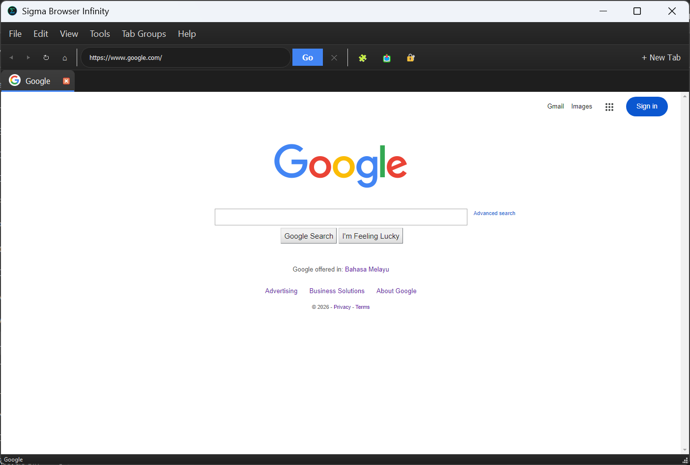

this browser is made by deepseek ai so uh it isnt good

# 🔥 Sigma Browser Infinity


*A browser with nothing you need - Limited possibilities*

A low-quality web browser built with Python and PyQt5, featuring a sleek modern design, advanced privacy features, and powerful tools for the modern web.



## ✨ Features

### Core Features
- 🌙 **Dark/Light Mode Toggle** - Switch between beautiful dark and light themes
- 🕶️ **Private/Incognito Mode** - Browse without saving history or cookies
- 🛡️ **Built-in Ad Blocker** - Block ads and trackers automatically
- 📥 **Download Manager** - Pause, resume, and manage downloads
- 🔐 **Password Manager** - Securely store and manage passwords with encryption
- 📁 **Tab Groups** - Save and organize tabs into groups
- 🧩 **Extensions Support** - Enable/disable extensions easily

### Advanced Features
- 🔍 **Developer Tools** - Inspect elements and view source
- ⌨️ **Keyboard Shortcuts** - Professional shortcut system
- 🖨️ **Print Support** - Print web pages directly
- 🔒 **Encrypted Storage** - All sensitive data is encrypted
- 📂 **Tab Management** - Drag and drop tabs
- 🎯 **Smart URL Bar** - Search Google or type URLs directly

## 🚀 Quick Start

### Prerequisites
- Python 3.7 or higher
- pip package manager

### Installation

1. **Clone the repository:**
```bash
git clone https://github.com/YOUR_USERNAME/sigma-browser-infinity.git
cd sigma-browser-infinity
```
2. **Install dependencies:**
```bash
pip install -r requirements.txt
```
3. **Run the browser:**
```bash
python browser.py
```
**Optional: Enhanced Security**
```bash
pip install cryptography
```

# ⌨️ Keyboard Shortcuts

| Shortcut | Action |
| -------- | ------ |
| Ctrl + T | New Tab |
| Ctrl + W | Close Tab |
| Ctrl + N | New Window |
| Ctrl + Shift + N | New Private Window |
| Ctrl + L | Focus Address Bar |
| Ctrl + R / F5	| Refresh Page |
| Ctrl + D | Bookmark Current Page |
| Ctrl + F | Find in Page |
| Ctrl + J | Open Downloads |
| Ctrl + B | View Bookmarks |
| Ctrl + Shift + I | Developer Tools |
| Ctrl + Shift + D | Toggle Dark/Light Mode |
| Ctrl + + | Zoom In |
| Ctrl + - | Zoom Out |
| Ctrl + 0 | Reset Zoom |
| Ctrl + Shift + Del | Clear Browsing Data |
| F11 | Full Screen |
| Escape | Stop Loading |

# 📁 Data Storage
Sigma Browser stores user data in:

Windows: %APPDATA%\SigmaBrowser\

Linux: ~/.config/SigmaBrowser/

macOS: ~/Library/Application Support/SigmaBrowser/

# 🛠️ Built With
*PyQt5* - GUI Framework

*PyQtWebEngine* - Web Engine

*Cryptography* - Password Encryption

# 🤝 Contributing
**Contributions are welcome! Feel free to:**

1. Fork the repository

2. Create a feature branch

3. Submit a pull request

# 📝 License
This project is licensed under the MIT License - see the LICENSE file for details.

# 📧 Contact
Project Link: https://github.com/microwave26/sigma-browser-infinity

# *⚡ Sigma Browser Infinity - Browse Without Limits ⚡*
